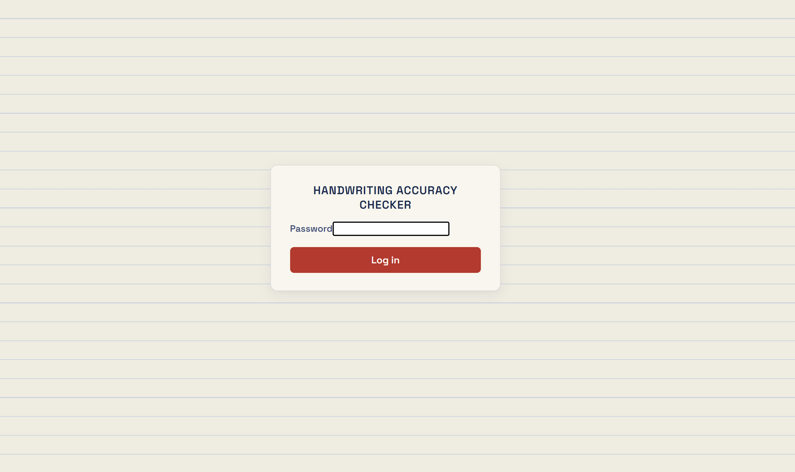
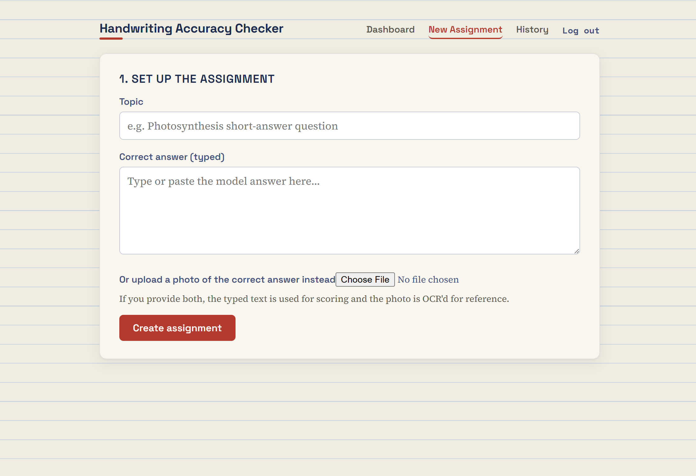
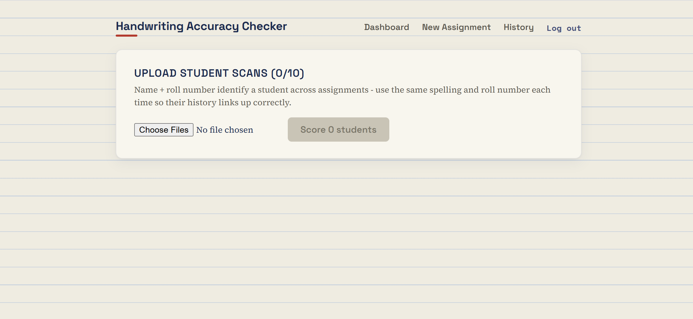
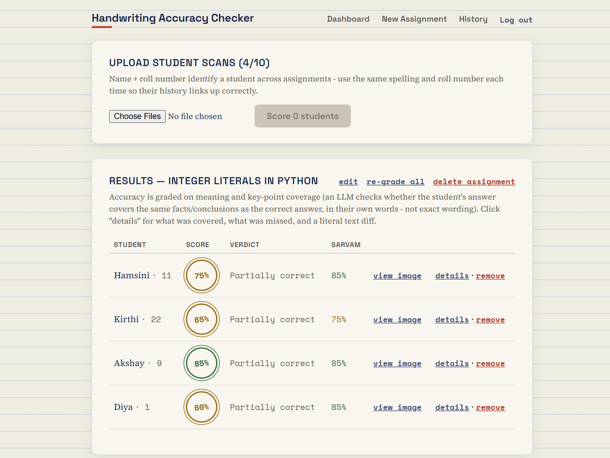
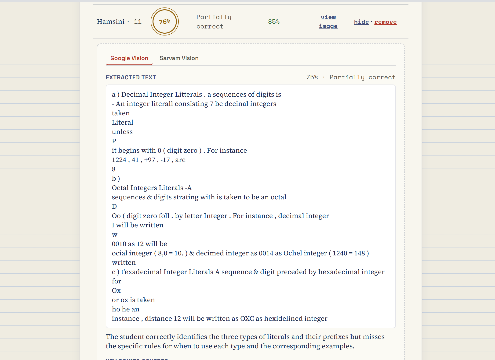
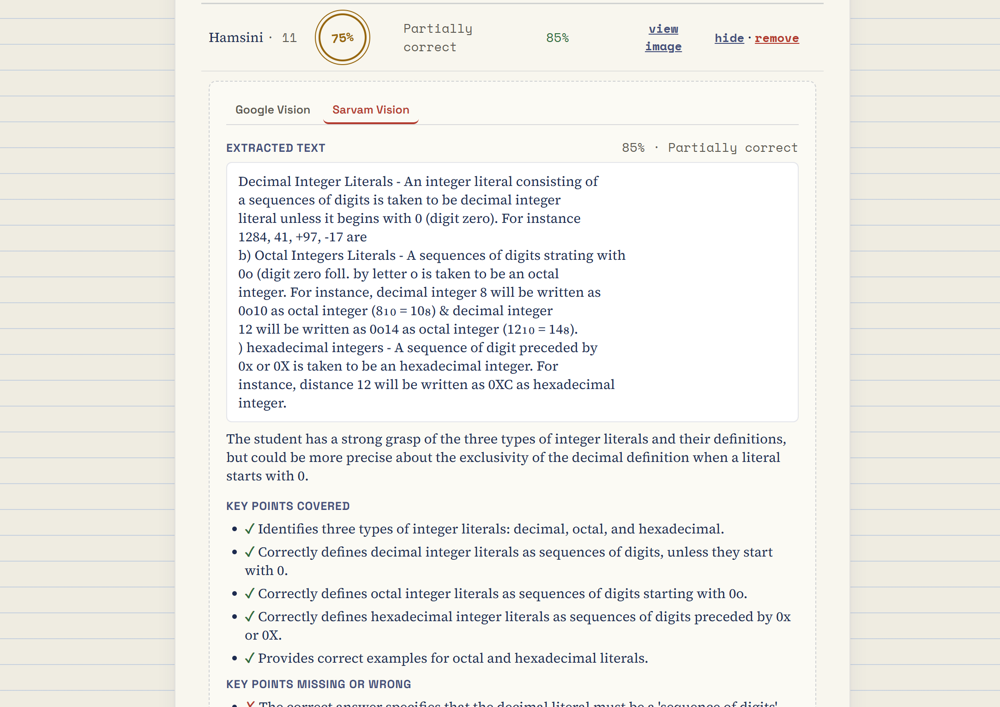

# AI Assignment Evaluation Platform

An AI-powered web application that automatically evaluates handwritten student assignments using OCR and semantic analysis. The platform extracts handwritten text from scanned answer sheets, compares student responses against a model answer, and generates accuracy scores based on meaning rather than exact wording.

Developed as part of an internship project at Resileo Labs.

---

## Features

- Upload and evaluate up to 10 handwritten student assignments at a time
- Handwriting recognition using Google Cloud Vision OCR
- Semantic answer evaluation using Sarvam AI (`sarvam-30b`)
- Accuracy score generation based on concept coverage
- Covered and missing key-point analysis
- Student performance tracking across assignments
- Assignment history and result persistence
- Supabase Storage integration for scanned answer sheets
- Re-grade submissions after updating the answer key

---

## Screenshots

### Home Screen



### Create Assignment



### Upload Student Assignments



### Results Dashboard



### Google OCR Evaluation



### Sarvam AI Evaluation



---

## Tech Stack

### Frontend
- React
- Vite
- JavaScript

### Backend
- Node.js
- Express.js

### Database & Storage
- PostgreSQL
- Supabase
- Supabase Storage

### AI & OCR
- Google Cloud Vision OCR
- Sarvam AI (`sarvam-30b`)

---

## System Workflow

```text
Assignment Upload
        ↓
Google Vision OCR
        ↓
Text Processing
        ↓
Sarvam AI Evaluation
        ↓
Accuracy Score Generation
        ↓
Result Storage in Supabase
```

---

## Getting Started

### 1. Prepare Credentials

You need the following environment variables:

- `APP_PASSWORD` — Application login password
- `GOOGLE_VISION_API_KEY` — Google Cloud Vision API key
- `SARVAM_API_KEY` — Sarvam AI API key
- `SUPABASE_URL` — Supabase project URL
- `SUPABASE_SERVICE_ROLE_KEY` — Supabase service role key

---

### 2. Backend Setup

```bash
cd backend
npm install
cp .env.example .env

# Add the required credentials to .env

npm run dev
```

The backend starts on:

```text
http://localhost:4000
```

Verify the backend:

```bash
curl http://localhost:4000/api/health
```

---

### 3. Frontend Setup

Open a second terminal:

```bash
cd frontend
npm install
npm run dev
```

The frontend starts on:

```text
http://localhost:5173
```

The frontend proxies `/api` requests to the backend during development.

---

### 4. Using the Application

1. Open `http://localhost:5173`
2. Log in using the application password
3. Create a new assignment with a topic and model answer
4. Upload student handwritten answer images
5. Review OCR output, AI evaluation, and accuracy scores

---

## Project Structure

```text
AI-Assignment-Evaluation-Platform/
│
├── backend/                  # Express API, OCR, grading, storage
├── frontend/                 # React + Vite application
│
├── frontend/screenshots/
│   ├── home.png
│   ├── create.png
│   ├── upload.png
│   ├── result.png
│   ├── ocr_result.png
│   └── sarvam_result.png
│
└── README.md
```

---

## Deployment Notes

This project consists of both a frontend and backend service.

- For local development, run the frontend and backend separately.
- Deploying only the frontend will result in `/api/*` requests returning `404`.
- The backend should be hosted separately and exposed through a public URL.

Build the frontend with the backend URL:

```bash
cd frontend
VITE_API_BASE=https://your-backend-url.com npm run build
```

---

## Future Improvements

- Multi-user authentication
- Teacher and student dashboards
- Batch PDF uploads
- Export reports as PDF or Excel
- AI-generated improvement suggestions
- Multi-language handwriting evaluation
- Advanced analytics dashboard
- Rubric-based grading support

---

## Notes

- Google Cloud Vision OCR is used as the primary handwriting recognition engine.
- Sarvam AI is used for semantic answer evaluation.
- The application currently supports a maximum of 10 student submissions per assignment.
- Results are stored in Supabase for future review and performance tracking.
- Assignment scores are based on semantic understanding and key-point coverage rather than exact word matching.

---

## Useful Commands

### Backend

```bash
cd backend
npm install
npm run dev
```

### Frontend

```bash
cd frontend
npm install
npm run dev
```

---

## Author

**Rithu Prabhu**

GitHub: https://github.com/restapi404

Internship Project @ Resileo Labs

---

## License

This project was developed as part of an internship at Resileo Labs and is intended for educational and portfolio purposes.